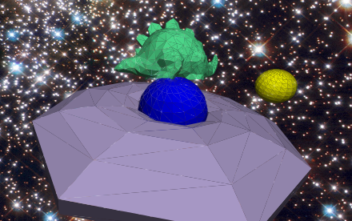

# graphics

See a live demo [here](https://robert.pirtle.xyz/graphics-demo/).

I made this mostly just to play with 3D graphics math. Why? Because this is the most hands-on linear algebra can be! A [custom webpack loader](polyLoader.js) loads [files of vertices and faces](src/data) then renders the polygons in 3D space.

It is all rendered in real time _on your CPU_! There's a branch I started on that uses fancy webGL shaders to render on your GPU, but I stopped work on it. Maybe someday?

I implemented a rudimentary light model to shade the polygons. It only draws polygons you can see (thanks normal vectors and dot products) and uses z-index sorting to draw them in the correct order.

The concepts (along with the stegosaurus polygons) were things I learned in a C++ advanced graphics course I took in college.

# license

[MIT](https://choosealicense.com/licenses/mit/) © 2020 Robert Pirtle
